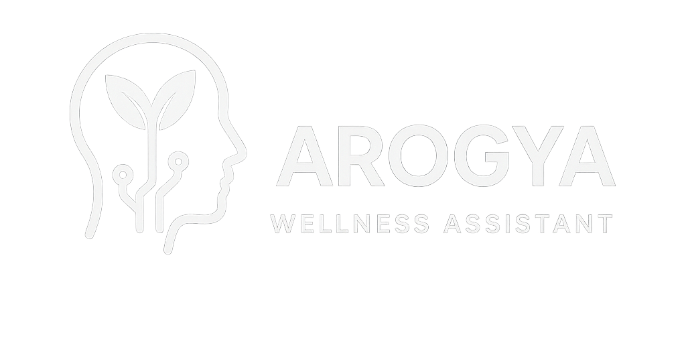

# Arogya Wellness Assistant

  

## About

Arogya Wellness Assistant is an AI-powered health consultation platform that provides personalized wellness guidance through intelligent conversation. Built with **LangChain's multi-agent framework**, it orchestrates specialized agents to deliver comprehensive advice across diet, fitness, lifestyle, and symptom analysis.

## Key Features

- **AI-Powered Health Consultation** - Get instant, personalized wellness advice
- **Multi-Agent System** - Specialized agents for diet, fitness, lifestyle, and symptoms
- **Smart Context Awareness** - Remembers your conversation history for meaningful follow-ups
- **Comprehensive Guidance** - Holistic health recommendations tailored to your needs
- **Interactive Chat Interface** - User-friendly, real-time conversation experience
- **Dark Mode Support** - Comfortable viewing in any lighting condition

## Technologies Used

**Backend:**

- LangChain - Agent orchestration and memory management
- Groq LLM - Fast AI inference
- FastAPI - Modern Python web framework
- MySQL - Conversation persistence

**Frontend:**

- React - Interactive user interface
- Vite - Fast build tooling
- Modern CSS - Responsive design

## How It Works

1. Share your health concerns or wellness questions
2. AI analyzes and routes to specialized agents
3. Receive personalized, actionable advice
4. Continue the conversation with context-aware follow-ups
5. Access your chat history anytime
